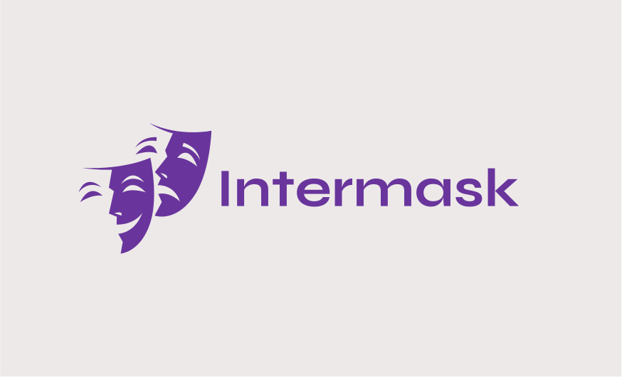

# Intermask

Intermask is a C++ library that integrates with Node.js through N-API, providing a lightweight interface for managing and manipulating webview windows. Developed under Kuaralabs, Intermask enables efficient creation and management of webview-based applications with functionality for setting titles, sizes, and more.



## Features

- **SetTitle**: Update the title of the webview window.
- **SetSize**: Adjust the dimensions of the webview window.
- **Navigate**: Load a specified URL into the webview.
- **Run**: Start the webview application.
- **Destroy**: Close and clean up the webview window.
- **OnEvent**: Register event handlers for custom events.
- **Evaluate**: Execute JavaScript code within the webview.
- **GetTitle**: Retrieve the current title of the webview.
- **SetBackgroundColor**: Change the background color of the webview.
- **SetCustomUserAgent**: Set a custom user-agent string for the webview.
- **OnResize**: Register a callback to be invoked when the window is resized.
- **GetAdditionalInfo**: Get additional information about the webview, such as dimensions.
- **IsDocumentReady**: Check if the document loaded in the webview is ready.

## Installation

To use Intermask, you will need Node.js and npm installed. You can build the project using the provided `binding.gyp` file.

**By package manager:**
```sh
npm i intermask
```

or

```sh
yarn add intermask
```

## Usage

Here is a basic example of how to use Intermask in a Node.js application:

```js
const Intermask = require('intermask');

const window = new Intermask();

// Set window title
window.setTitle('My Application');

// Set window size
window.setSize(800, 600);

// Navigate to a URL
window.navigate('https://www.example.com');

// Run the application
window.run();

// Set background color
window.setBackgroundColor('#ffffff');

// Set custom user agent
window.setCustomUserAgent('MyCustomUserAgent/1.0');

// Evaluate JavaScript in the webview
window.evaluate('console.log("Hello from Intermask!");');

// Check if the document is ready
window.isDocumentReady().then(ready => {
    console.log('Document ready:', ready);
});

// Get additional information
window.getAdditionalInfo().then(info => {
    console.log('Window Info:', info);
});
```

## API Documentation

- **`SetTitle(title: string)`**: Sets the title of the webview window.
- **`SetSize(width: number, height: number)`**: Sets the size of the webview window.
- **`Navigate(url: string)`**: Loads a URL into the webview.
- **`Run()`**: Starts the webview application.
- **`Destroy()`**: Closes the webview window.
- **`OnEvent(callback: Function)`**: Registers a callback function for custom events.
- **`Evaluate(jsCode: string)`**: Executes JavaScript code in the webview.
- **`GetTitle()`**: Retrieves the current title of the webview.
- **`SetBackgroundColor(color: string)`**: Sets the background color of the webview.
- **`SetCustomUserAgent(userAgent: string)`**: Sets a custom user-agent string for the webview.
- **`OnResize(callback: Function)`**: Registers a callback function for window resize events.
- **`GetAdditionalInfo()`**: Retrieves additional information about the webview (e.g., dimensions).
- **`IsDocumentReady()`**: Checks if the document is fully loaded.

## Contributing

Contributions are welcome! Please fork the repository, make your changes, and submit a pull request. For major changes, please open an issue first to discuss what you would like to change.

## License

This project is licensed under the [GNU General Public License v3.0](https://www.gnu.org/licenses/gpl-3.0.html). See the [LICENSE](LICENSE) file for details.

## Contact

For any inquiries or support, please reach out to Kuaralabs at [contact@kuaralabs.com](mailto:contact@kuaralabs.com) or with "Intermask" title please at [project@kuaralabs.com](mailto:project@kuaralabs.com)
